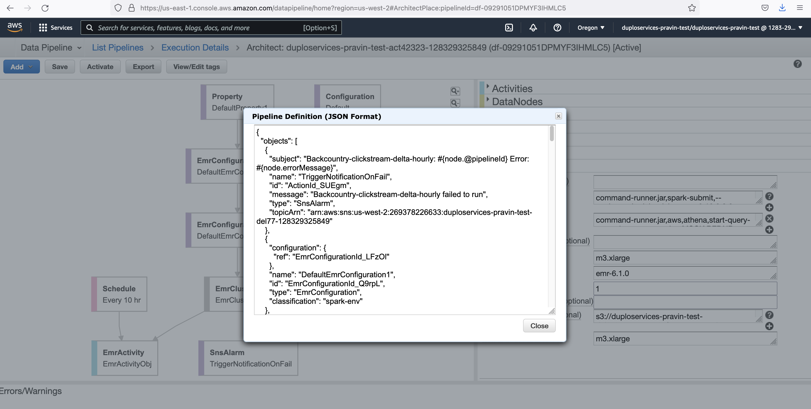
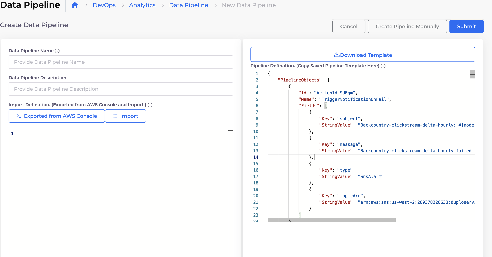
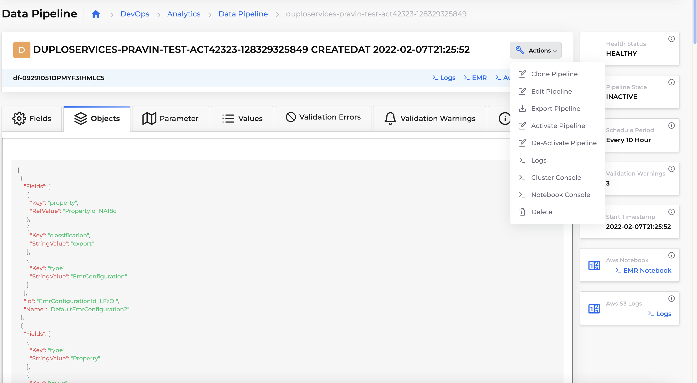

# Data pipeline

## Introduction

AWS Data Pipeline is a web service that helps you reliably process and move data between different AWS compute and storage services, as well as on-premises data sources, at specified intervals. With AWS Data Pipeline, you can regularly access your data where it’s stored, transform and process it at scale, and efficiently transfer the results to AWS services such as Amazon S3, Amazon RDS, Amazon DynamoDB, and Amazon EMR.

AWS Data Pipeline helps you easily create complex data processing workloads that are fault tolerant, repeatable, and highly available. You don’t have to worry about ensuring resource availability, managing inter-task dependencies, retrying transient failures or timeouts in individual tasks, or creating a failure notification system. AWS Data Pipeline also allows you to move and process data that was previously locked up in on-premises data silos.

## Create data pipeline

A data pipeline can be created using any of the following ways:

* [Using DuploCloud UI](data-pipeline.md#using-duplocloud-ui)
* [Using an exported template from AWS console](data-pipeline.md#using-exported-template-in-aws-console)
* [Cloning an existing template](data-pipeline.md#clone-existing-data-pipeline)

### Using DuploCloud UI

Proceed to **Devops → Analytics -> Data Pipeline**. Click on +**Add** button.

Enter relevant information on the form. Click **Generate** button. The form includes information like - name, description, s3 log folder, cron schedule details, EMR resources, EMR steps, etc.&#x20;


Review generated JSON, and make any further changes to generated JSON



### Using exported template in AWS console

Proceed to **Devops → Analytics -> Data Pipeline.** Click on +**Add** button. Click '**Import Pipeline Template'**&#x20;

In AWS console Proceed to **Data Pipeline -> Choose Existing Data Pipeline -> Click Edit -> Click  Export**. Please review generated **JSON**, and make any further changes to generated JSON. Click **Submit.**




### Clone existing data pipeline

Copy previously exported template from the form. Please do any additional changes (such as schedule frequency, EMR steps). Click **Submit** to save the Data Pipeline.

Existing Data Pipelines can be **cloned** in List View or Details View.



## List view

To get JIT (Just In Time) access to appropriate AWS console, click on **Data Pipeline, EMR Console, EMR  Jupyter Console**. Click **** row level menu actions to manage the Data Pipeline. e.g. Clone, Edit, Export, Delete etc.&#x20;


## Details view

Use Details view to update Data Pipeline. Use JIT (Just In Time) access to AWS console. Check Errors and warnings.



## Example data pipeline template

There are two types of Data Pipeline templates:

1. [Exported template in AWS console](data-pipeline.md#aws-console-exported-template)
2. [Exported template in DuploCloud UI](data-pipeline.md#duplocloud-exported-template)

### AWS console exported template

```json
{
    "ParameterValues": [
        {
            "Id": "myEMRReleaseLabel",
            "StringValue": "emr-6.1.0"
        },
        {
            "Id": "myMasterInstanceType",
            "StringValue": "m3.xlarge"
        },
        {
            "Id": "myBootstrapAction",
            "StringValue": "s3://duploservices-pravin-test-del1-128329325849/bootstrap_actions/customactionsstream_back_py_libraries.sh"
        },
        {
            "Id": "myEmrStep",
            "StringValue": "command-runner.jar,spark-submit,--packages,io.delta:delta-core_2.12:0.8.0,--conf,spark.sql.extensions=io.delta.sql.DeltaSparkSessionExtension,--conf,spark.sql.catalog.spark_catalog=org.apache.spark.sql.delta.catalog.DeltaCatalog,--num-executors,2,--executor-cores,2,--executor-memory,2G,--conf,spark.driver.memoryOverhead=4096,--conf,spark.executor.memoryOverhead=4096,--conf,spark.dynamicAllocation.enabled=false,--name,PixelcustomactionsstreamData,--py-files,s3://duploservices-pravin-test-del1-128329325849/libraries/ua_parser.zip,--py-files,s3://duploservices-pravin-test-del1-128329325849/libraries/user_agents.zip,--py-files,s3://duploservices-pravin-test-del1-128329325849/libraries/trmLocation.zip,s3://duploservices-pravin-test-del1-128329325849/duplo_test/transform-pixel-data-to-parquet.py,s3://duploservices-pravin-test-del1-128329325849/duplo_test/sample_raw_data,s3://duploservices-pravin-test-del1-128329325849/duplo_test/output/,true,append,s3://duploservices-pravin-test-del1-128329325849/duplo_test/trmLocation.bin,s3://duploservices-pravin-test-del1-128329325849/duplo_test/customactionsstream_retailer_config.json,hourly,{\"retailer\":\"test\"}"
        },
        {
            "Id": "myEmrStep",
            "StringValue": "command-runner.jar,aws,athena,start-query-execution,--query-string,MSCK REPAIR TABLE backcountry.customactionsstream_hourly_delta,--result-configuration,OutputLocation=s3://duploservices-pravin-test-del1-128329325849/logs/athena/backcountry/customactionsstream_hourly_delta"
        },
        {
            "Id": "myCoreInstanceType",
            "StringValue": "m3.xlarge"
        },
        {
            "Id": "myCoreInstanceCount",
            "StringValue": "1"
        }
    ],
    "ParameterObjects": [
        {
            "Attributes": [
                {
                    "Key": "helpText",
                    "StringValue": "An existing EC2 key pair to SSH into the master node of the EMR cluster as the user \"hadoop\"."
                },
                {
                    "Key": "description",
                    "StringValue": "EC2 key pair"
                },
                {
                    "Key": "optional",
                    "StringValue": "true"
                },
                {
                    "Key": "type",
                    "StringValue": "String"
                }
            ],
            "Id": "myEC2KeyPair"
        },
        {
            "Attributes": [
                {
                    "Key": "helpLink",
                    "StringValue": "https://docs.aws.amazon.com/console/datapipeline/emrsteps"
                },
                {
                    "Key": "watermark",
                    "StringValue": "s3://myBucket/myPath/myStep.jar,firstArg,secondArg"
                },
                {
                    "Key": "helpText",
                    "StringValue": "A step is a unit of work you submit to the cluster. You can specify one or more steps"
                },
                {
                    "Key": "description",
                    "StringValue": "EMR step(s)"
                },
                {
                    "Key": "isArray",
                    "StringValue": "true"
                },
                {
                    "Key": "type",
                    "StringValue": "String"
                }
            ],
            "Id": "myEmrStep"
        },
        {
            "Attributes": [
                {
                    "Key": "helpText",
                    "StringValue": "Task instances run Hadoop tasks."
                },
                {
                    "Key": "description",
                    "StringValue": "Task node instance type"
                },
                {
                    "Key": "optional",
                    "StringValue": "true"
                },
                {
                    "Key": "type",
                    "StringValue": "String"
                }
            ],
            "Id": "myTaskInstanceType"
        },
        {
            "Attributes": [
                {
                    "Key": "default",
                    "StringValue": "m1.medium"
                },
                {
                    "Key": "helpText",
                    "StringValue": "Core instances run Hadoop tasks and store data using the Hadoop Distributed File System (HDFS)."
                },
                {
                    "Key": "description",
                    "StringValue": "Core node instance type"
                },
                {
                    "Key": "type",
                    "StringValue": "String"
                }
            ],
            "Id": "myCoreInstanceType"
        },
        {
            "Attributes": [
                {
                    "Key": "default",
                    "StringValue": "emr-5.13.0"
                },
                {
                    "Key": "helpText",
                    "StringValue": "Determines the base configuration of the instances in your cluster, including the Hadoop version."
                },
                {
                    "Key": "description",
                    "StringValue": "EMR Release Label"
                },
                {
                    "Key": "type",
                    "StringValue": "String"
                }
            ],
            "Id": "myEMRReleaseLabel"
        },
        {
            "Attributes": [
                {
                    "Key": "default",
                    "StringValue": "2"
                },
                {
                    "Key": "description",
                    "StringValue": "Core node instance count"
                },
                {
                    "Key": "type",
                    "StringValue": "Integer"
                }
            ],
            "Id": "myCoreInstanceCount"
        },
        {
            "Attributes": [
                {
                    "Key": "description",
                    "StringValue": "Task node instance count"
                },
                {
                    "Key": "optional",
                    "StringValue": "true"
                },
                {
                    "Key": "type",
                    "StringValue": "Integer"
                }
            ],
            "Id": "myTaskInstanceCount"
        },
        {
            "Attributes": [
                {
                    "Key": "helpLink",
                    "StringValue": "https://docs.aws.amazon.com/console/datapipeline/emr_bootstrap_actions"
                },
                {
                    "Key": "helpText",
                    "StringValue": "Bootstrap actions are scripts that are executed during setup before Hadoop starts on every cluster node."
                },
                {
                    "Key": "description",
                    "StringValue": "Bootstrap action(s)"
                },
                {
                    "Key": "isArray",
                    "StringValue": "true"
                },
                {
                    "Key": "optional",
                    "StringValue": "true"
                },
                {
                    "Key": "type",
                    "StringValue": "String"
                }
            ],
            "Id": "myBootstrapAction"
        },
        {
            "Attributes": [
                {
                    "Key": "default",
                    "StringValue": "m1.medium"
                },
                {
                    "Key": "helpText",
                    "StringValue": "The Master instance assigns Hadoop tasks to core and task nodes, and monitors their status."
                },
                {
                    "Key": "description",
                    "StringValue": "Master node instance type"
                },
                {
                    "Key": "type",
                    "StringValue": "String"
                }
            ],
            "Id": "myMasterInstanceType"
        }
    ],
    "PipelineObjects": [
        {
            "Fields": [
                {
                    "Key": "property",
                    "RefValue": "PropertyId_NA18c"
                },
                {
                    "Key": "classification",
                    "StringValue": "export"
                },
                {
                    "Key": "type",
                    "StringValue": "EmrConfiguration"
                }
            ],
            "Id": "EmrConfigurationId_LFzOl",
            "Name": "DefaultEmrConfiguration2"
        },
        {
            "Fields": [
                {
                    "Key": "type",
                    "StringValue": "Property"
                },
                {
                    "Key": "value",
                    "StringValue": "/usr/bin/python3"
                },
                {
                    "Key": "key",
                    "StringValue": "PYSPARK_PYTHON"
                }
            ],
            "Id": "PropertyId_NA18c",
            "Name": "DefaultProperty1"
        },
        {
            "Fields": [
                {
                    "Key": "taskInstanceType",
                    "StringValue": "#{myTaskInstanceType}"
                },
                {
                    "Key": "subnetId",
                    "StringValue": "subnet-09ce080c2630b9ad7"
                },
                {
                    "Key": "onFail",
                    "RefValue": "ActionId_SUEgm"
                },
                {
                    "Key": "maximumRetries",
                    "StringValue": "1"
                },
                {
                    "Key": "configuration",
                    "RefValue": "EmrConfigurationId_Q9rpL"
                },
                {
                    "Key": "coreInstanceCount",
                    "StringValue": "#{myCoreInstanceCount}"
                },
                {
                    "Key": "masterInstanceType",
                    "StringValue": "#{myMasterInstanceType}"
                },
                {
                    "Key": "releaseLabel",
                    "StringValue": "#{myEMRReleaseLabel}"
                },
                {
                    "Key": "type",
                    "StringValue": "EmrCluster"
                },
                {
                    "Key": "terminateAfter",
                    "StringValue": "3 Hours"
                },
                {
                    "Key": "bootstrapAction",
                    "StringValue": "#{myBootstrapAction}"
                },
                {
                    "Key": "resourceRole",
                    "StringValue": "duploservices-pravin-test"
                },
                {
                    "Key": "taskInstanceCount",
                    "StringValue": "#{myTaskInstanceCount}"
                },
                {
                    "Key": "coreInstanceType",
                    "StringValue": "#{myCoreInstanceType}"
                },
                {
                    "Key": "keyPair",
                    "StringValue": "duploservices-pravin-test"
                },
                {
                    "Key": "region",
                    "StringValue": "us-west-2"
                },
                {
                    "Key": "applications",
                    "StringValue": "spark"
                }
            ],
            "Id": "EmrClusterObj",
            "Name": "EmrClusterObj"
        },
        {
            "Fields": [
                {
                    "Key": "failureAndRerunMode",
                    "StringValue": "CASCADE"
                },
                {
                    "Key": "resourceRole",
                    "StringValue": "duploservices-pravin-test"
                },
                {
                    "Key": "pipelineLogUri",
                    "StringValue": "s3://duploservices-pravin-test-del1-128329325849/logs/data-pipelines/"
                },
                {
                    "Key": "role",
                    "StringValue": "DuploAWSDataPipelineRole"
                },
                {
                    "Key": "scheduleType",
                    "StringValue": "cron"
                }
            ],
            "Id": "Default",
            "Name": "Default"
        },
        {
            "Fields": [
                {
                    "Key": "period",
                    "StringValue": "10 Hour"
                },
                {
                    "Key": "startDateTime",
                    "StringValue": "2022-02-07T21:29:00"
                },
                {
                    "Key": "type",
                    "StringValue": "Schedule"
                }
            ],
            "Id": "ScheduleId_NfOUF",
            "Name": "Every 10 hr"
        },
        {
            "Fields": [
                {
                    "Key": "subject",
                    "StringValue": "Backcountry-customactionsstream-delta-hourly: #{node.@pipelineId} Error: #{node.errorMessage}"
                },
                {
                    "Key": "message",
                    "StringValue": "Backcountry-customactionsstream-delta-hourly failed to run"
                },
                {
                    "Key": "type",
                    "StringValue": "SnsAlarm"
                },
                {
                    "Key": "topicArn",
                    "StringValue": "arn:aws:sns:us-west-2:269378226633:duploservices-pravin-test-del77-128329325849"
                }
            ],
            "Id": "ActionId_SUEgm",
            "Name": "TriggerNotificationOnFail"
        },
        {
            "Fields": [
                {
                    "Key": "schedule",
                    "RefValue": "ScheduleId_NfOUF"
                },
                {
                    "Key": "step",
                    "StringValue": "#{myEmrStep}"
                },
                {
                    "Key": "runsOn",
                    "RefValue": "EmrClusterObj"
                },
                {
                    "Key": "type",
                    "StringValue": "EmrActivity"
                }
            ],
            "Id": "EmrActivityObj",
            "Name": "EmrActivityObj"
        },
        {
            "Fields": [
                {
                    "Key": "configuration",
                    "RefValue": "EmrConfigurationId_LFzOl"
                },
                {
                    "Key": "type",
                    "StringValue": "EmrConfiguration"
                },
                {
                    "Key": "classification",
                    "StringValue": "spark-env"
                }
            ],
            "Id": "EmrConfigurationId_Q9rpL",
            "Name": "DefaultEmrConfiguration1"
        }
    ]
}
```

### DuploCloud exported template

```json
{
  "objects": [
    {
      "subject": "Backcountry-clickstream-delta-hourly: #{node.@pipelineId} Error: #{node.errorMessage}",
      "name": "TriggerNotificationOnFail",
      "id": "ActionId_SUEgm",
      "message": "Backcountry-clickstream-delta-hourly failed to run",
      "type": "SnsAlarm",
      "topicArn": "arn:aws:sns:us-west-2:269378226633:duploservices-pravin-test-del77-128329325849"
    },
    {
      "configuration": {
        "ref": "EmrConfigurationId_LFzOl"
      },
      "name": "DefaultEmrConfiguration1",
      "id": "EmrConfigurationId_Q9rpL",
      "type": "EmrConfiguration",
      "classification": "spark-env"
    },
    {
      "subnetId": "subnet-09ce080c2630b9ad7",
      "taskInstanceType": "#{myTaskInstanceType}",
      "onFail": {
        "ref": "ActionId_SUEgm"
      },
      "maximumRetries": "1",
      "configuration": {
        "ref": "EmrConfigurationId_Q9rpL"
      },
      "coreInstanceCount": "#{myCoreInstanceCount}",
      "masterInstanceType": "#{myMasterInstanceType}",
      "releaseLabel": "#{myEMRReleaseLabel}",
      "type": "EmrCluster",
      "terminateAfter": "3 Hours",
      "bootstrapAction": "#{myBootstrapAction}",
      "resourceRole": "duploservices-pravin-test",
      "taskInstanceCount": "#{myTaskInstanceCount}",
      "name": "EmrClusterObj",
      "coreInstanceType": "#{myCoreInstanceType}",
      "keyPair": "duploservices-pravin-test",
      "id": "EmrClusterObj",
      "region": "us-west-2",
      "applications": "spark"
    },
    {
      "schedule": {
        "ref": "ScheduleId_NfOUF"
      },
      "name": "EmrActivityObj",
      "step": "#{myEmrStep}",
      "runsOn": {
        "ref": "EmrClusterObj"
      },
      "id": "EmrActivityObj",
      "type": "EmrActivity"
    },
    {
      "name": "DefaultEmrConfiguration2",
      "property": {
        "ref": "PropertyId_NA18c"
      },
      "id": "EmrConfigurationId_LFzOl",
      "classification": "export",
      "type": "EmrConfiguration"
    },
    {
      "period": "10 Hour",
      "startDateTime": "2022-02-07T21:18:20.737+00:00",
      "name": "Every 10 hr",
      "id": "ScheduleId_NfOUF",
      "type": "Schedule"
    },
    {
      "failureAndRerunMode": "CASCADE",
      "resourceRole": "duploservices-pravin-test",
      "role": "DuploAWSDataPipelineRole",
      "pipelineLogUri": "s3://duploservices-pravin-test-del1-128329325849/logs/data-pipelines/",
      "scheduleType": "cron",
      "name": "Default",
      "id": "Default"
    },
    {
      "name": "DefaultProperty1",
      "id": "PropertyId_NA18c",
      "type": "Property",
      "value": "/usr/bin/python3",
      "key": "PYSPARK_PYTHON"
    }
  ],
  "parameters": [
    {
      "helpText": "An existing EC2 key pair to SSH into the master node of the EMR cluster as the user \"hadoop\".",
      "description": "EC2 key pair",
      "optional": "true",
      "id": "myEC2KeyPair",
      "type": "String"
    },
    {
      "helpLink": "https://docs.aws.amazon.com/console/datapipeline/emrsteps",
      "watermark": "s3://myBucket/myPath/myStep.jar,firstArg,secondArg",
      "helpText": "A step is a unit of work you submit to the cluster. You can specify one or more steps",
      "description": "EMR step(s)",
      "isArray": "true",
      "id": "myEmrStep",
      "type": "String"
    },
    {
      "helpText": "Task instances run Hadoop tasks.",
      "description": "Task node instance type",
      "optional": "true",
      "id": "myTaskInstanceType",
      "type": "String"
    },
    {
      "default": "m1.medium",
      "helpText": "Core instances run Hadoop tasks and store data using the Hadoop Distributed File System (HDFS).",
      "description": "Core node instance type",
      "id": "myCoreInstanceType",
      "type": "String"
    },
    {
      "default": "emr-5.13.0",
      "helpText": "Determines the base configuration of the instances in your cluster, including the Hadoop version.",
      "description": "EMR Release Label",
      "id": "myEMRReleaseLabel",
      "type": "String"
    },
    {
      "default": "2",
      "description": "Core node instance count",
      "id": "myCoreInstanceCount",
      "type": "Integer"
    },
    {
      "description": "Task node instance count",
      "optional": "true",
      "id": "myTaskInstanceCount",
      "type": "Integer"
    },
    {
      "helpLink": "https://docs.aws.amazon.com/console/datapipeline/emr_bootstrap_actions",
      "helpText": "Bootstrap actions are scripts that are executed during setup before Hadoop starts on every cluster node.",
      "description": "Bootstrap action(s)",
      "isArray": "true",
      "optional": "true",
      "id": "myBootstrapAction",
      "type": "String"
    },
    {
      "default": "m1.medium",
      "helpText": "The Master instance assigns Hadoop tasks to core and task nodes, and monitors their status.",
      "description": "Master node instance type",
      "id": "myMasterInstanceType",
      "type": "String"
    }
  ],
  "values": {
    "myMasterInstanceType": "m3.xlarge",
    "myEMRReleaseLabel": "emr-6.1.0",
    "myBootstrapAction": "s3://duploservices-pravin-test-del1-128329325849/bootstrap_actions/clickstream_backcountry_py_libraries.sh",
    "myEmrStep": [
      "command-runner.jar,spark-submit,--packages,io.delta:delta-core_2.12:0.8.0,--conf,spark.sql.extensions=io.delta.sql.DeltaSparkSessionExtension,--conf,spark.sql.catalog.spark_catalog=org.apache.spark.sql.delta.catalog.DeltaCatalog,--num-executors,2,--executor-cores,2,--executor-memory,2G,--conf,spark.driver.memoryOverhead=4096,--conf,spark.executor.memoryOverhead=4096,--conf,spark.dynamicAllocation.enabled=false,--name,PixelClickstreamData,--py-files,s3://duploservices-pravin-test-del1-128329325849/libraries/ua_parser.zip,--py-files,s3://duploservices-pravin-test-del1-128329325849/libraries/user_agents.zip,--py-files,s3://duploservices-pravin-test-del1-128329325849/libraries/IP2Location.zip,s3://duploservices-pravin-test-del1-128329325849/duplo_test/transform-pixel-data-to-parquet.py,s3://duploservices-pravin-test-del1-128329325849/duplo_test/sample_raw_data,s3://duploservices-pravin-test-del1-128329325849/duplo_test/output/,true,append,s3://duploservices-pravin-test-del1-128329325849/duplo_test/IP2LOCATION-LITE-DB5.IPV6.BIN,s3://duploservices-pravin-test-del1-128329325849/duplo_test/clickstream_retailer_config.json,hourly,{\"retailer\":\"test\"}",
      "command-runner.jar,aws,athena,start-query-execution,--query-string,MSCK REPAIR TABLE backcountry.clickstream_hourly_delta,--result-configuration,OutputLocation=s3://duploservices-pravin-test-del1-128329325849/logs/athena/backcountry/clickstream_hourly_delta"
    ],
    "myCoreInstanceCount": "1",
    "myCoreInstanceType": "m3.xlarge"
  }
}
```
